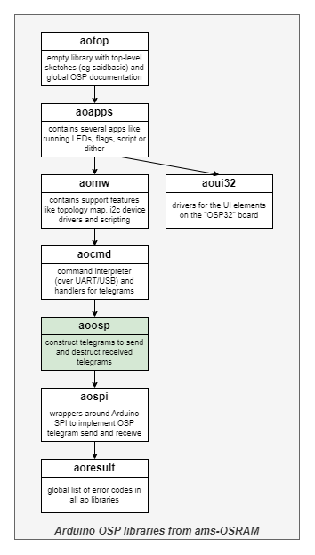
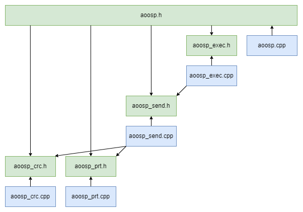

# OSP Telegrams aoosp

Library "OSP Telegrams aoosp", usually abbreviated to "aoosp",
is one of the **aolibs**; short for Arduino OSP libraries from ams-OSRAM.
This suite implements support for chips that use the Open System Protocol, 
like the AS1163 ("SAID") or the OSIRE E3731i ("RGBi").
The landing page for the _aolibs_ is on 
[GitHub](https://github.com/ams-OSRAM-Group/OSP_aotop).


## Introduction

Library _aoosp_ is at the heart of the dependency graph.

It contains functions to construct telegrams (byte arrays) to be send to OSP nodes.
It also contains functions to destruct response telegrams received back from OSP nodes.
Both functions are hidden behind the API; the API allows sending and receiving telegrams.

For telegram transmit this library relies on a communications layer, typically _aospi_.
That library expects a board like **OSP32**.




## Examples

This library comes with the following examples.
You can find them in the Arduino IDE via 
File > Examples > OSP Telegrams aoosp > ...

- **aoosp_crc**  
  This demo computes the CRC of a telegram (byte buffer).
  Once to compute the required CRC for sending a command.
  Once to check the CRC in an incoming response.

- **aoosp_min**  
  This demo sends a minimal set of OSP telegrams that light up an LED
  connected to a SAID channel. Once using BiDir, once using Loop.
  Then repeats.

- **aoosp_topo**   
  This demo scans all nodes and prints out the chain configuration:
  comms for both SIOs, dir, state, number of RGBs and I2C.

- **aoosp_error**  
  This demo shows how error handling works in SAID. The STAT register has 
  error flags denoting which errors occurred. The SETUP register has flags
  denoting which errors need to be trapped. When an error occurs 
  (is flagged in STAT) whose trap bit is set (in SETUP), then the error
  is handled by switching to SLEEP state. This switches off the PWMs. 

- **aoosp_group**  
  This demo groups two SAIDs, then sends PWM commands to that group.
  One command to switch the group to red, one command to switch the 
  group to green. Then repeats.

- **aoosp_i2c**   
  This demo first performs an I2C scan using the I2C bridge in a SAID.
  Then it issues I2C read and write transactions to an EEPROM memory.
  assumed to have I2C device address 0x50 connected to the first SAID.
  Finally it polls the INT line and shows its status on SAID1.RGB0.

- **aoosp_otp**   
  This demo reads and writes from/to the OTP of a SAID.

- **aoosp-sync**  
  This demo shows how to use the SYNC feature; a feature that switches on all 
  LEDs at the same time. We first enable (channels) of nodes for SYNC
  (AOOSP_CURCHN_FLAGS_SYNCEN). Next, set those channels to some PWM value.
  Finally we issue a SYNC by broadcasting the SYNC telegram. This makes
  all (channels) of all nodes that are configured for SYNC to activate their
  PWM settings.

- **aoosp_time**
  This demo sends a series of telegrams. The series originally comes from 
  `aomw_topo_build`. We measure how long it takes to run that series.
  Once we use the high level aoosp API, and once we use low level aospi API.
  The conclusion is that the software overhead can be ignored.


## Module architecture

This library contains 4 modules, see figure below (arrows indicate #include).



- **aoosp_crc** (`aoosp_crc.cpp` and `aoosp_crc.h`) is a small module that implements 
  one function. It computes the OSP CRC checksum of a byte array. The module is stateless.
  
- **aoosp_prt** (`aoosp_prt.cpp` and `aoosp_prt.h`) is a slightly bigger module that implements 
  several functions to pretty print telegrams. It is normally not used in production code.
  It is extensively used by the logging feature of module aoosp_send.

- **aoosp_send** (`aoosp_send.cpp` and `aoosp_send.h`) is the _core_ module of the library.
  It contains functions the send commands and receive the responses if there is any.
  The module supports both RGBi's and SAIDs. Not all telegrams are implemented yet.
  The module is stateless, with one exception: it records if logging is enabled or disabled.

- **aoosp_exec** (`aoosp_exec.cpp` and `aoosp_exec.h`) is contains higher level features, 
  which typically send multiple telegrams. A very prominent example is `aoosp_exec_resetinit()`
  which sends a RESET and INIT telegram, but auto detects if BiDir (terminator) or 
  Loop (cable) is configured. Other high level functions help in accesses I2C devices 
  connected to the SAID, or the OTP memory inside the SAID. Also stateless.
   
Each module has its own header file, but the library has an overarching header `aoosp.h`,
which includes the module headers. It is suggested that users just include the overarching 
header.


## API

The header [aoosp.h](src/aoosp.h) contains the API of this library.
It includes the module headers [aoosp_crc.h](src/aoosp_crc.h), [aoosp_prt.h](src/aoosp_prt.h), 
[aoosp_send.h](src/aoosp_send.h) and [aoosp_exec.h](src/aoosp_exec.h).
The headers contain little documentation; for that see the module source files. 


### aoosp

- `aoosp_init()` not really needed, but added for forward compatibility.
- `AOOSP_VERSION`  identifies the version of the library.


### aoosp_crc

- `aoosp_crc()` the only function implemented in this modules; computes the CRC of a byte array.


### aoosp_prt

Contains several functions to print telegram fields more user friendly. Examples are:

- `aoosp_prt_temp_said()` to convert a SAID raw temperature to Celsius.
- `aoosp_prt_stat_state()` to convert a node state to a string.
- `aoosp_prt_bytes()` to convert a byte array (like a telegram) to a string.

These functions are publicly accessible, but are intended for logging in this library.

Warning: pretty print functions that return a `char *` all use the same global 
character buffer  for returning the string. This means that only _one_ such function 
can be used at a time. For example this will not work: 
```
  printf("%s-%s", aoosp_prt_stat_rgbi(x), aoosp_prt_stat_said(x) )
```


### aoosp_send

This is the core of the library. In principle it contains one function per telegram type.
Examples are

- `aoosp_send_reset()` resets all nodes in the chain (all "off"; they also lose their address).
- `aoosp_send_initloop()` assigns an address to each node; also configures all nodes for Loop.
- `aoosp_send_clrerror()` clears the error flags of the addressed node.
- `aoosp_send_goactive()` switches the state of the addressed node to active.
- `aoosp_send_readpwmchn()`  asks the addressed node to respond with its PWM settings of one of its channel.

This module supports logging. 
Via `aoosp_loglevel_set()` and `aoosp_loglevel_get()` the log level can be manipulated:

- `aoosp_loglevel_none` nothing is logged (default).
- `aoosp_loglevel_args` logging of sent and received telegram arguments.
- `aoosp_loglevel_tele` also logs raw (sent and received) telegram bytes.


### aoosp_exec

Some operations on OSP nodes require multiple telegrams.
Some frequent ones have been abstracted in this module.

- `aoosp_exec_resetinit()`         sends RESET and INIT telegrams, auto detecting BiDir or Loop.
- `aoosp_exec_otpdump()`           reads the entire OTP and prints details requested in flags.
- `aoosp_exec_setotp()`            updates one bye in OTP.
- `aoosp_exec_i2cenable_get()`     reads the I2C_BRIDGE_EN bit in OTP (mirror).
- `aoosp_exec_i2cenable_set()`     writes the I2C_BRIDGE_EN bit in OTP (mirror).
- `aoosp_exec_i2cpower()`          checks if the SAID has an I2C bridge, if so, powers the I2C bus.
- `aoosp_exec_syncpinenable_get()` reads the SYNC_PIN_EN bit from OTP (mirror).
- `aoosp_exec_syncpinenable_set()` writes the SYNC_PIN_EN bit to OTP (mirror).
- `aoosp_exec_i2cwrite8()`         writes to an I2C device connected to a SAID with I2C bridge.
- `aoosp_exec_i2cread8()`          reads from an I2C device connected to a SAID with I2C bridge.


## Version history _aoosp_

- **2024 August 5, 0.3.0**  
  - In `aoosp_send.h` all non-implemented TID tagged as not-yet-implemented or reserved.
  - Corrected link to GitHub from aotop to OSP_aotop.
  - Remove "oalib" from `sentence=` in `library.properties`.
  - Added `#include "../../said-password.h"`.
  - Added `aoosp_exec_syncpinenable_get()` and `aoosp_exec_syncpinenable_set()` and hw sync in `aoosp_sync.ino`.
  - Arduino name changed from `OSP Telegrams - aoosp` to `OSP Telegrams aoosp`.
  - Renamed dir `extra` to `extras`.
  - `license.txt`, `examples\xxx.ino` line endings changed from LF to CR+LF.
  - Fixed argument test in `aoosp_con_setcurchn()`.

- **2024 Jul 02, 0.2.4**  
  - Initial release candidate.


(end)

